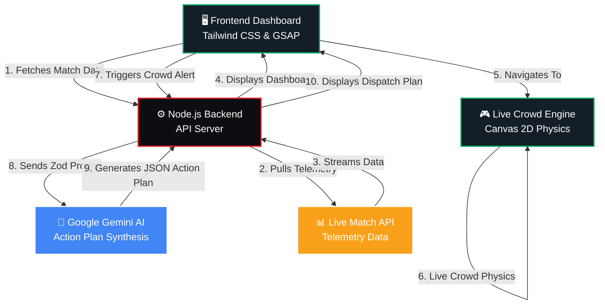

# Smart Stadium

Smart Stadium is a second-screen web app for live FIFA 2026 matches. The first slice of the product is a cinematic landing hero that masks backend latency, sets the dark neon brand direction, and prepares the surface for sentiment-driven match moments.

## Initial Structure

* [server/index.js](server/index.js) is a Cloud Run-friendly Node server that serves the frontend and exposes a health check.
* [public/index.html](public/index.html) is the Tailwind-only landing shell.
* [public/js/app.js](public/js/app.js) bootstraps the landing screen and validates the hero content model with Zod.
* [public/js/components/heroSection.js](public/js/components/heroSection.js) renders the premium split-screen hero and GSAP reveal choreography.
* [public/js/schemas.js](public/js/schemas.js) holds the Zod schema used by the frontend.

## 📸 Screenshots

Here are the key interfaces of the FIFA Crowd Management system:

### 1. Main Dashboard (Live Telemetry & Vibe Selection)


### 2. Live Crowd Flow (Real-time Heatmap & Congestion Simulation)


### 3. AI Crowd Action Plan (Gemini-generated Responses)


*(Note: To make these images appear on GitHub, please save your screenshots inside a `docs` folder in this repository named `dashboard.png`, `live_flow.png`, and `ai_plan.png` respectively, and push them to GitHub).*

## 🏗️ Architecture Graph



## 🏆 Problem Statement Alignment (Gen AI Integration)

This project heavily leverages **Google Gemini AI** to solve the complex challenge of **FIFA 2026 Crowd Management**:
1. **Live Telemetry Ingestion**: The dashboard monitors mock real-time stadium metrics (e.g., Gate Congestion, Crowd Density, Wait Times).
2. **AI Action Plan Synthesis**: When a critical threshold is reached (e.g., "Congestion Alert"), the backend securely prompts Gemini using strict Zod schemas to generate a **Crowd Action Plan**.
3. **Automated Dispatch**: The GenAI outputs actionable instructions for stadium staff (e.g., "Deploy 15 stewards to Sector B", "Open Overflow Gate 3").
4. **Fan Engagement**: Simultaneously, the AI crafts personalized push notifications to redirect fans safely, enhancing both security and the fan experience.

## Run it

Install dependencies later if you add any, then start the local Node server:

```powershell
npm run dev
```

Open [http://localhost:3000](http://localhost:3000) after the server starts.

## Notes

* Tailwind CSS is loaded via CDN for the initial landing screen.
* GSAP handles the hero entrance animation and latency-masking reveal.
* Tests are implemented using Jest and Supertest. run `npm test` to verify endpoints.
* Security headers (CSP, HSTS) and Rate Limiting are enforced in the Node server.
